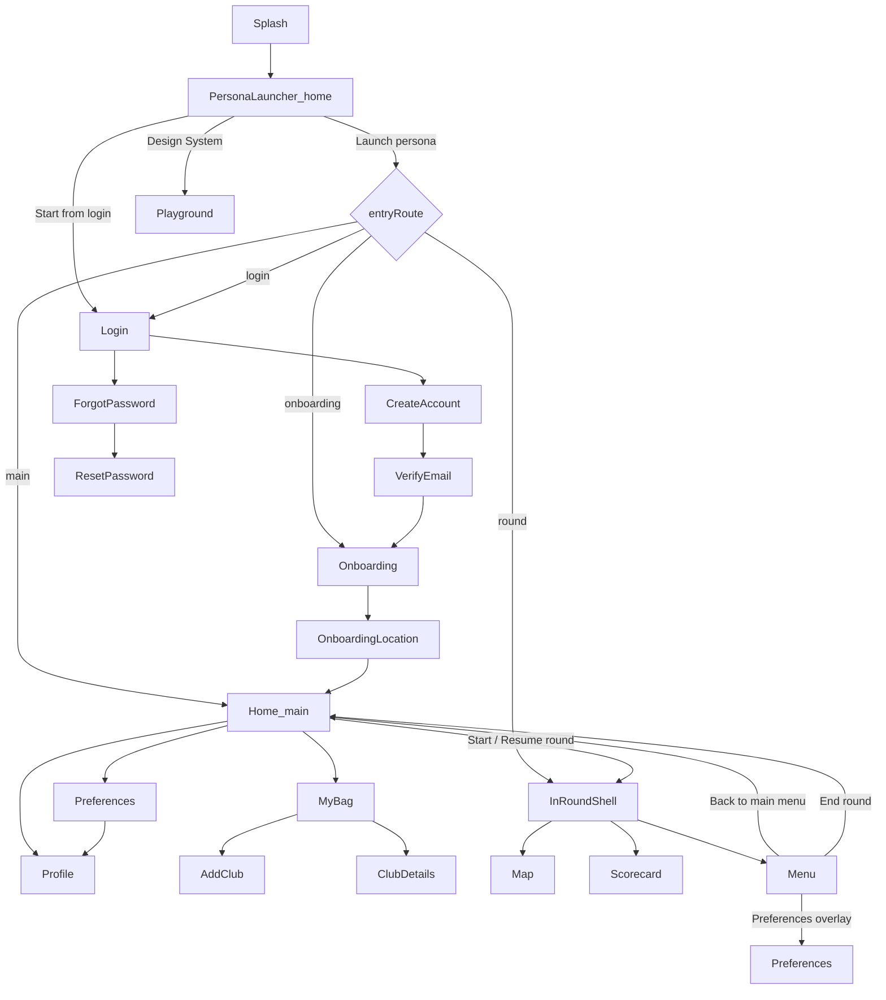

# App sitemap

**Audience:** everyone  
**Source of truth:** [`apps/mobile/src/app/routes.ts`](../apps/mobile/src/app/routes.ts), [`AppShell.tsx`](../apps/mobile/src/app/AppShell.tsx)

Navigation is a single `route` state machine in `AppShell`. There is no React Navigation stack.

## High-level flowchart

## Route table

| Route | Screen | How you get there |
|-------|--------|-------------------|
| `home` | Persona launcher (`AppHome`) | App start (always); also fallback when route isn’t a dedicated screen |
| `playground` | Design system catalog | “Design System” on launcher |
| `login` | Log in | Persona override / auth entry |
| `create-account` | Create account | From login |
| `verify-email` | Verify email | After create account |
| `forgot-password` | Forgot password | From login |
| `reset-password` | Reset password | After forgot password |
| `onboarding` | Profile onboarding | Onboarding persona / post-verify |
| `onboarding-location` | Permissions-style steps | Onboarding flow continuation |
| `main` | Home | Seasoned persona; leave/end round |
| `profile` | Profile | Home or Preferences |
| `preferences` | Preferences | Home quick action / menu overlay |
| `my-bag` | My bag | Home quick action |
| `add-club` | Add club | My bag “Add” |
| `club-details` | Club details | Tap a club in My bag |
| `round` | In-round shell | Start / resume round; In-round persona |

## In-round shell (tabs)

While `route === "round"`, [`InRoundShell`](../apps/mobile/src/screens/in-round/InRoundShell.tsx) owns three tabs. The map layer stays mounted; scorecard slides from the top, menu from the bottom.

| Tab | Screen | Notes |
|-----|--------|-------|
| Map | `RoundMapScreen` | Map canvas, bottom sheet, distances, wind |
| Scorecard | `RoundScorecardScreen` | Grid + shot stepper; caddie / voice FABs |
| Menu | `RoundMenuScreen` | Round settings, prefs, leave, end |

### Round session vs pause

- **Back to main menu** — pauses the round: home shows Resume; `InRoundShell` stays mounted (hidden) so state is preserved.
- **End round** — clears the active round session and returns to home without resume.

### Overlays inside the round

From Menu → Preferences (and Profile from preferences), overlays replace the tab UI without changing the `round` route, so returning doesn’t remount the map session.

## Persona launcher entries

| Persona | Label | Default entry |
|---------|-------|---------------|
| `seasonedUser` | Seasoned user | `main` |
| `onboarding` | New user onboarding | `onboarding` |
| `inRound` | In-round (map) | `round` |

Optional checkbox on the launcher: **Start from login** forces `login` regardless of persona entry.

## Related docs

- [Product overview](01-product-overview.md)
- [Feature logic](03-feature-logic.md)
- [Data & state](04-data-and-state.md)
