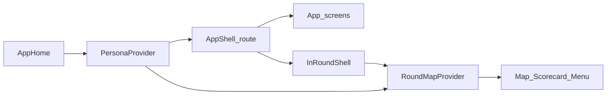

# Data & state model

**Audience:** developers, AIs  

There is **no production backend**. Session truth lives in React context and local component state. Refreshing the web app or killing Expo resets persona overrides.

## Architecture overview



## PersonaProvider (mock “backend”)

**File:** [`apps/mobile/src/personas/PersonaProvider.tsx`](../apps/mobile/src/personas/PersonaProvider.tsx)

| State | Role |
|-------|------|
| `activePersonaId` | Which persona’s static `data` is active |
| `clubSelection` | Which add-club IDs are in the bag |
| `clubDetailsOverrides` | Session edits to make / name / distance / shotTypes |

Derived:
- `clubDetails` = persona defaults ∪ overrides
- `bagData` = sections rebuilt from selection + details
- `bagClubCount` = selected club count

Switching persona clears overrides and rebuilds selection from that persona’s defaults.

### Important types

Defined in [`apps/mobile/src/personas/types.ts`](../apps/mobile/src/personas/types.ts):

```ts
ClubShotType = { id, label, distance }
ClubDetails = { id, intro, make, name, distance, shotTypes? }
PersonaData = { home, profile, bag, preferences, clubDetails, addClub, round, auth }
```

Helpers: [`apps/mobile/src/personas/utils.ts`](../apps/mobile/src/personas/utils.ts) (`getClubDetails`, bag builders, formatting).

## AppShell route state

**File:** [`apps/mobile/src/app/AppShell.tsx`](../apps/mobile/src/app/AppShell.tsx)

| State | Role |
|-------|------|
| `route` | Current screen (`AppRoute`) |
| `hasActiveRound` | Whether a round session exists (resume vs start) |
| `activeRoundConfig` | Course / format / tees / golfers for the session |
| `roundSessionKey` | Remount key when starting a new round |
| `selectedClubId` | Club details target |
| `profileReturnRoute` | Where Profile back goes |
| `pendingVerificationEmail` | Auth demo handoff |

Initial route: persona launcher (`devLauncher: true` → `"home"`). See [`resolveInitialRoute.ts`](../apps/mobile/src/app/resolveInitialRoute.ts).

## RoundMapProvider (in-round session)

**File:** [`apps/mobile/src/round/RoundMapProvider.tsx`](../apps/mobile/src/round/RoundMapProvider.tsx)

Holes come from static mock data: [`apps/mobile/src/round/mock/elmgreenHoles.ts`](../apps/mobile/src/round/mock/elmgreenHoles.ts).

| State | Role |
|-------|------|
| `config` | Round configuration (editable from menu) |
| `currentHoleIndex` | Active hole in `elmgreenHoles` |
| `sheetExpanded` | Bottom sheet expanded / collapsed |
| `targetMode` / `target` | Aiming overlay point |
| `lie` / `slope` | Condition inputs for plays-like |
| `shotNumber` | Current hole stroke count |
| `holeScores` | `Record<holeNumber, strokes>` |

Derived:
- `displayDistances` ← current hole front/middle/back
- `playsLikeYards` ← `computePlaysLikeYards(...)`
- `clubRecommendation` ← `recommendClub(playsLike, fallback, bagOptions)`
- `bagOptions` ← `buildClubDistanceOptions(bag clubs, clubDetails)`

Hole changes reset target/lie/slope/sheet and can commit the leaving hole’s score when the shot stepper was dirty.

## Appearance (theme)

**File:** [`apps/mobile/src/app/AppearanceProvider.tsx`](../apps/mobile/src/app/AppearanceProvider.tsx)

| State | Role |
|-------|------|
| `appearance` | `light` \| `dark` \| `system` (default `system`) |
| `ready` | True after AsyncStorage hydrate |

Wraps `@kaddie/ui` `ThemeProvider`. Resolved scheme drives `useColors()` for app chrome. In-round screens ignore this and use `inRoundColors`.

## Persistence boundaries

| Survives | Does not survive |
|----------|------------------|
| Appearance preference (AsyncStorage) | — |
| In-round pause → resume (shell kept mounted) | Browser refresh / app kill (except appearance) |
| Club detail edits within a persona session | Persona switch (overrides cleared) |
| Hole scores within a round session | Ending the round (`hasActiveRound = false`) |

## What to assume when extending

1. Prefer reading/writing through `usePersona` / `useRoundMap` rather than inventing parallel stores.
2. Don’t invent API clients or databases unless explicitly tasked.
3. Mock formulas (plays-like, wind demo, voice scripts) are placeholders—document changes when replacing them.

## Related docs

- [Feature logic](03-feature-logic.md)
- [For AI agents](05-for-ai.md)
